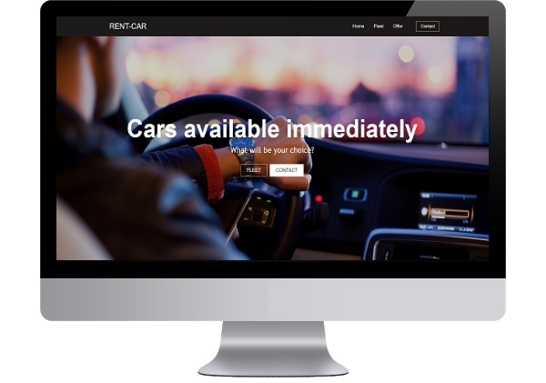
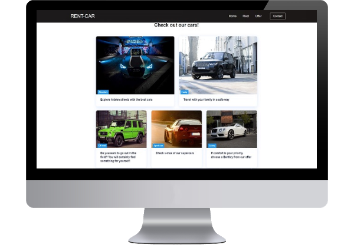
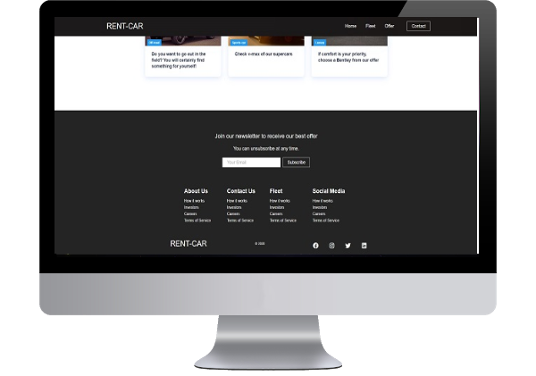
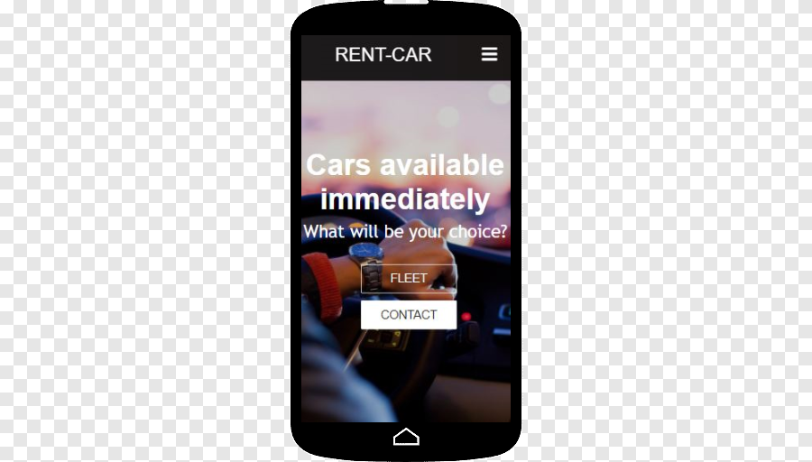
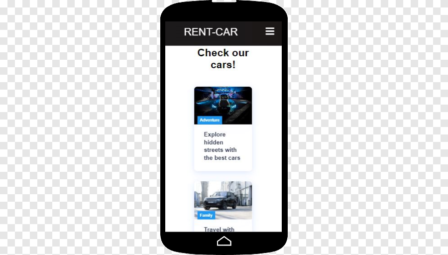

## Landing page for cars rental

Fully responsive Single Page Application for cars rental.

## Technologies

- HTML
- CSS
- JavaScript
- React
- Responsive Web Design

## Live

[Link](https://czyzu05.github.io/cars-rental-website-react/)

## Screens

## Setup

- Clone down this repository. You will need node and npm installed globally on your machine.
- Write in terminal(in path with cloned repository):
  ** npm install
  ** npm start
